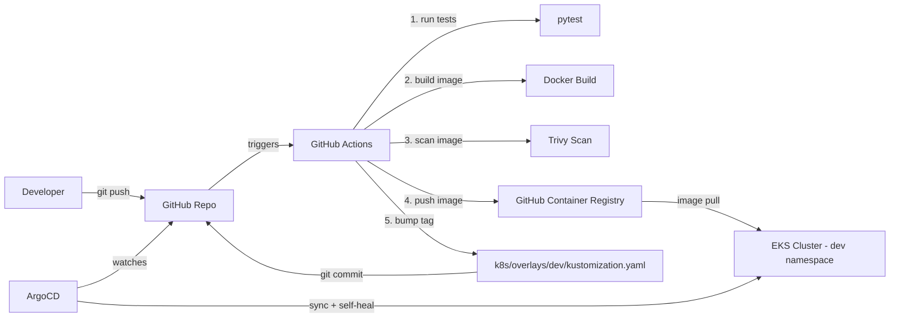

# CI/CD Pipeline with GitOps on EKS

A small, production-shaped example of a **GitOps delivery pipeline**: code push → automated build/test/scan → container image published → ArgoCD continuously reconciles the cluster to match Git.

This repo is intentionally scoped small (one Flask API) so the *pipeline mechanics* are the focus — the same pattern scales to any number of services.

## Architecture



**Why this design:** GitHub Actions never touches the cluster directly — it only updates a manifest in Git. ArgoCD is the only thing with cluster credentials, and it continuously reconciles live state to match Git (`selfHeal: true`), so the cluster can't drift from what's committed. This separation (CI builds artifacts, CD/GitOps deploys them) is the core GitOps principle and a common interview talking point.

## Repo structure

```
app/                    Flask app + Dockerfile + unit tests
.github/workflows/      CI pipeline: test -> build -> scan -> push -> bump manifest
k8s/base/               Base Kubernetes manifests (Deployment, Service)
k8s/overlays/dev/       Kustomize overlay auto-updated by CI (this is what ArgoCD watches)
k8s/overlays/prod/      Kustomize overlay promoted manually via PR after dev validation
argocd/                 ArgoCD Application definition (declares what ArgoCD should sync)
```

## Prerequisites

- A Kubernetes cluster — EKS for production use, or `kind`/`minikube` locally to build and demo this for free
- `kubectl` and `kustomize` (or `kubectl` >= 1.21, which has Kustomize built in)
- ArgoCD installed on the cluster
- A GitHub repo (this one, once you push it) with Actions enabled

## Quickstart (local demo with kind)

```bash
# 1. Spin up a local cluster
kind create cluster --name gitops-demo

# 2. Install ArgoCD
kubectl create namespace argocd
kubectl apply -n argocd -f https://raw.githubusercontent.com/argoproj/argo-cd/stable/manifests/install.yaml

# 3. Point ArgoCD at your fork (edit argocd/application.yaml: replace OWNER with your GitHub username)
kubectl apply -f argocd/application.yaml

# 4. Watch it sync
kubectl get applications -n argocd
kubectl get pods -n dev

# 5. Access ArgoCD UI (optional)
kubectl port-forward svc/argocd-server -n argocd 8080:443
# username: admin
# password: kubectl -n argocd get secret argocd-initial-admin-secret -o jsonpath="{.data.password}" | base64 -d
```

## How a change flows through the system

1. You push a code change to `app/`.
2. GitHub Actions runs unit tests, builds the Docker image, scans it with Trivy, and pushes it to GHCR.
3. The pipeline commits a new image tag into `k8s/overlays/dev/kustomization.yaml`.
4. ArgoCD detects the Git change within its poll interval (or via webhook) and syncs the cluster automatically.
5. If someone manually edits a resource in the cluster (e.g. `kubectl edit`), ArgoCD's `selfHeal` reverts it back to match Git — the cluster state always reflects Git, not tribal knowledge.

## Promoting to production

Prod is **not** auto-deployed. To promote a build that's been validated in dev, open a PR that bumps `newTag` in `k8s/overlays/prod/kustomization.yaml`. This gives you an auditable, reviewable production deployment — every prod release is a merged PR.

## What I'd add with more time

- Slack/webhook notification on ArgoCD sync failure
- Automated rollback if post-deploy smoke tests fail
- Progressive delivery (canary/blue-green) via Argo Rollouts
- Sealed Secrets or External Secrets Operator for managing app secrets in Git safely
- Terraform module to provision the EKS cluster itself (see the companion IaC project)

## Tech stack

GitHub Actions · Docker · Trivy · Kustomize · ArgoCD · Kubernetes (EKS) · Flask · Python
